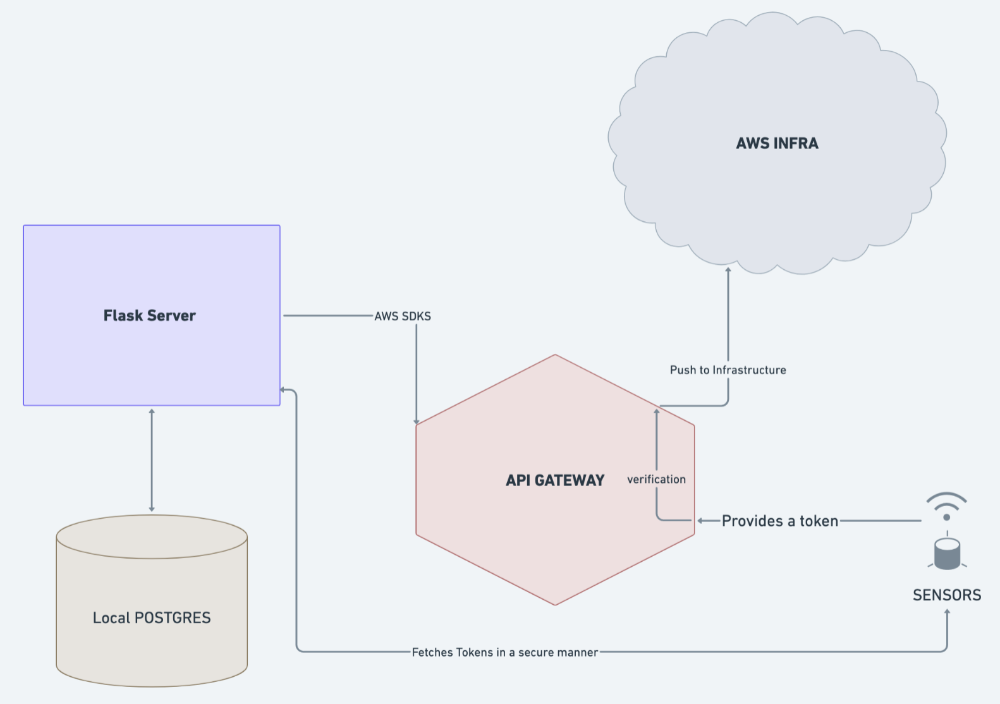

# Project Title: TokenSystem

## Description
The TokenSystem project manages tokens and handles them efficiently. It includes functionalities for creating users, managing token information, and defining usage plans. The project is built using Flask for the backend, with JWT authentication for secure user access.

## Table of Contents
1. Installation
2. Usage
3. Contributing
4. License

## Installation
To run the project locally:
1. Set up a PostgreSQL database as per the schema defined in `create_sql_schema.sql`.
2. Update the database credentials in the Flask app configuration.
3. Install the required Python packages using `pip install -r requirements.txt`.
4. Run the Flask app using `python app.py`.

## Usage
A simple example of how to run the project:
`python app.py`
<!--
## Contributing
Contributions are welcome. Please follow the guidelines in the `CONTRIBUTING.md` file.

## License
This project is licensed under the MIT License. See `LICENSE` for more details.
-->
